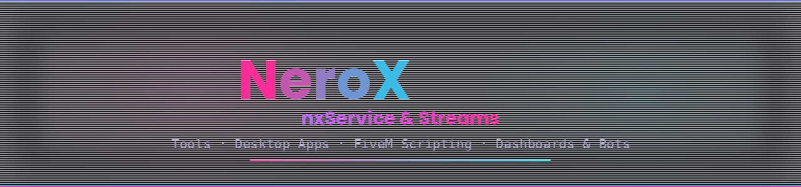

---

### 🚀 About me

I build tools, not just scripts. My main focus right now is **[nxCode](https://github.com/neroxservice/nxcode)**,
a full desktop code editor (Electron + React + Monaco) with an anime/neon look,
built specifically around **FiveM/Lua scripting** — native autocomplete,
format-on-save, split-view, the works.

Alongside that I build **FiveM resources** (ESX & QBCore), **admin panels
and dashboards**, and **Discord bots** for servers and communities.

---

### 🧩 What I build

<table>
<tr>
<td valign="top" width="33%">

**🖥️ Desktop Tools**

Electron apps, custom code editors, admin panels — built for real workflows, not demos.

</td>
<td valign="top" width="33%">

**🎮 FiveM Development**

ESX & QBCore resources, NUI interfaces, custom natives-aware tooling.

</td>
<td valign="top" width="33%">

**🌐 Dashboards & Bots**

Discord bots, web dashboards, Node.js backends tying servers together.

</td>
</tr>
</table>

---

### ⭐ Featured project

  

A desktop code editor built on Monaco (the same core as VS Code), styled in
neon pink/cyan, and purpose-built for FiveM scripting: ~6,700 real GTA5
natives with autocomplete, ESX/CFX function docs, split-view editing,
format-on-save, and a self-updating Windows installer.

 

---

### 📁 Current projects

| Project | Description | Status |
|---|---|---|
| [`nxCode`](https://github.com/neroxservice/nxcode) | Neon-themed desktop code editor for FiveM/Lua & web dev | 🟢 Active |
| [`nx_EmergencyResponse`](https://github.com/neroxservice/nx_emergencyresponse) | Emergency call system with randomized logic & smart spawning | 🟢 Active |
| [`npc_mechanic_jobs`](https://github.com/neroxservice/npc_mechanic_jobs) | NPC mechanic job system with randomized locations & callbacks | 🟢 Active |
| [`nx_weste`](https://github.com/neroxservice/nx_weste) | QBCore vest/armor script | 🟢 Active | 
| [`nxSleepV2`]([https://github.com/neroxservice/nx_weste](https://github.com/neroxservice/nxSleepV2)) | ESX Sex & Sleep System + Pregnancy and Birth | 🟢 Active | 
| [`nx_bettersync`](https://github.com/neroxservice/nx_bettersync) | FiveM sync script for smoother entity sync | 🚧 In progress |
| More coming... | | 🚧 In progress |

---

### 💻 Tech stack

---

### 📬 Contact

📨 **Discord:** `xrealchronosskt`
📫 **Email:** _on request only_

---

If you like my work, drop a ⭐ on the repos — it genuinely helps visibility.

